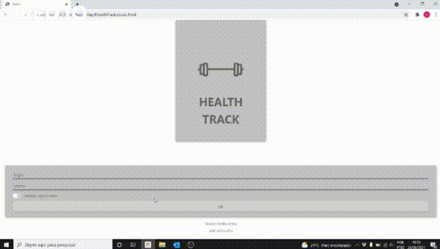
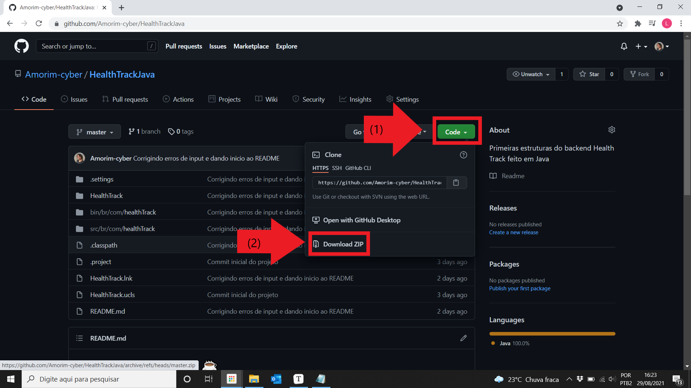
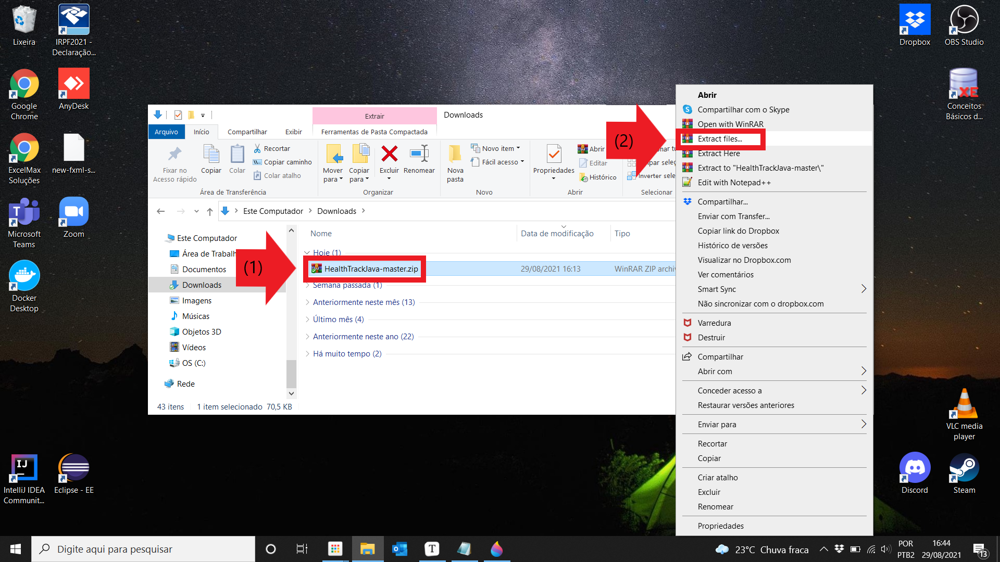
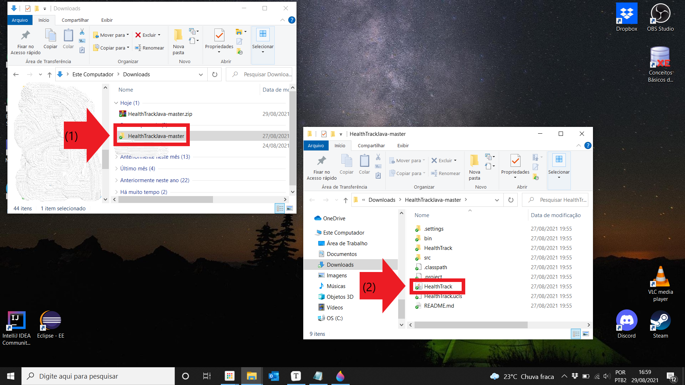
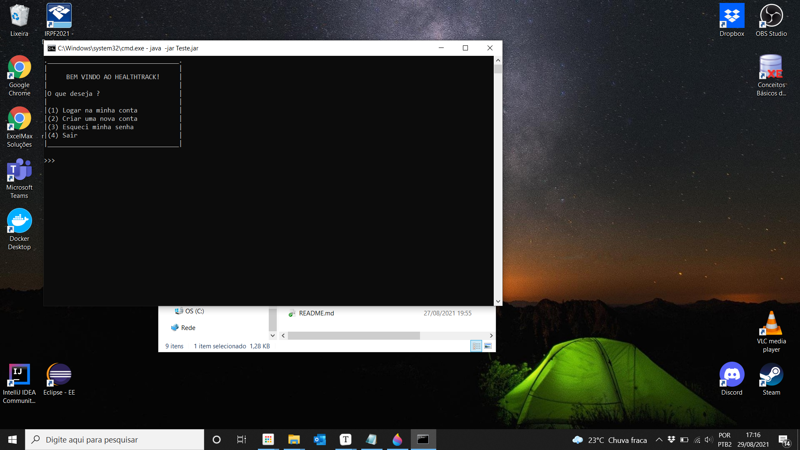
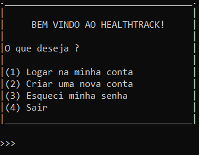
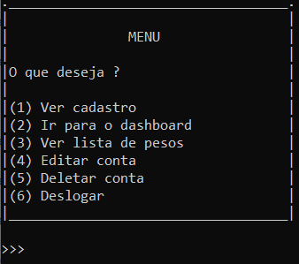
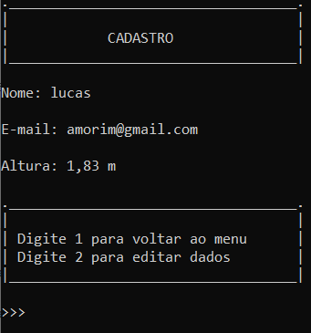
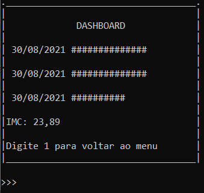
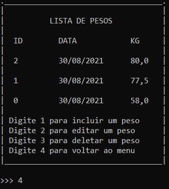

# Health Track Java :coffee:

#### início

Fala galera, este projeto tem como motivação simular as funcionalidades do Health Track utilizando a linguagem java.

#### tech utilizada

* Java

#### índice

O README foi dividido nos seguintes tópicos:

* O que é o Health Track ?
* Como abrir o programa
* Navegação
* Considerações Finais

#### O que é o Health Track ?

O Health Track é uma aplicação que registra e monitora a pesagem dos usuários. Primeiramente o usuário precisa fazer um cadastro para entrar no sistema. Após efetuar o login ele pode visualizar seus dados de cadastro; registrar, visualizar e editar sua lista de pesos; e consultar um dashboard dos dados  junto com o cálculo do último IMC.

Elaborei um protótipo utilizando HTML e CSS para ilustrar como seria o Health Track em ação.

</img>

Segue Repositório deste protótipo para maiores informações: 

https://github.com/Amorim-cyber/HealthTrack

#### Como abrir o programa

Siga os seguintes passos:

1. Baixe o arquivo neste repositório

   </img>

2. Extraia o arquivo e salve em um diretório de sua escolha 

   </img>

3. Clique no arquivo descompactado (nesse exemplo coloquei na pasta downloads) e em seguida clique na aplicação "HealthTrack"

   </img>

##### PRONTO

A aplicação está pronta para uso.

</img>

### Navegação

Segue guia de uso do sistema por telas

* TELA LOGIN

  Ponto inicial da aplicação do qual o usuário tem 4 opções: (1) - Logar na conta, (2) - criar uma nova, (3) - recuperar senha e (4) - sair do programa.
  
  </img>

<ol>
        <li><b>Logar na minha conta</b> encaminha o usuário para a tela de menu, contudo para tal precisa inputar um login e senha. O usuário obrigatoriamente precisa criar uma nova conta para entrar no sistema. Quando o programa é finalizado, toda informação adicionada ao sistema é deletada. </li>
        <li><b>Criar uma nova conta</b> solicita que o usuário digite algumas informações para prosseguir, existe certas exigências a serem cumpridas:
            <ul>
                <li>Todos os inputs não podem apresentar espaços</li>
                <li>A nova senha precisa ser identica a senha repetida logo em seguida</li>
                <li>O e-mail precisa obrigatóriamente conter @</li>
                <li>Não coloque caracteres diferentes de números quando for inputar sua altura</li>
            </ul>    
    	</li>
        <li><b>Esqueci minha senha</b> encaminha para uma tela de recuperação onde o usuario digita um e-mail, o sistema vai printar uma mensagem confirmando o envio. O ideal seria mandar os dados de login e senha por e-mail, entretanto essa funcionalidade ainda não foi implementada no sistema.</li>
        <li><b>Sair</b> finaliza o programa</li>
    </ol>

* TELA MENU

  Após logar, o usuário vai visualizar a tela menu do qual ele tem 6 opções: (1) - Visualizar cadastro, (2) - Ir para o dashboard, (3) - Visualizar lista de pesos, (4) - Edição de conta, (5) - Deletar conta, (6) - Deslogar da sessão.

  </img>

  <ol>
          <li><b>Ver cadastro</b> encaminha o usuário para a tela de cadastro </li>
          <li><b>Ir para o dashboard</b> encaminha o usuário para a tela de dashboard   
      	</li>
          <li><b>Ver lista de pesos</b> encaminha o usuário para a tela de pesos</li>
          <li><b>Editar conta</b> posibilita que o usuário mude o login e senha da conta <i>(lembrando que todos os inputs não podem apresentar espaços)</i></li>
      	<li><b>Deletar conta</b> deleta todas as informações do usuário existente</li>
      	<li><b>Deslogar</b> retorna para a tela inicial, os dados do usuário continuam existindo</li>
  </ol>

* TELA CADASTRO

  A tela de cadastro retorna para o usuário seus dados de nome, e-mail e altura. Ele tem 2 opções: (1) - voltar para o menu e (2) - editar dados.

  </img>

  <ol>
          <li><b>Voltar ao menu</b> retorna para o menu </li>
          <li><b>Editar conta</b> posibilita que o usuário mude nome, e-mail e altura <i>(lembrando que todos os inputs não podem apresentar espaços)</i></li>
  </ol>

* TELA DASHBOARD

  A tela de dashboard é uma tentativa de visualizar os pesos registrados em gráfico de barras por meio de "#". Inicialmente ele não vai ter pesos registrados, a adição de pesos é realizada na tela de pesos. Outra característica da tela é o retorno do Índice de massa corporal (IMC) do último peso registrado. O usuário tem apenas uma opção: (1) - voltar para o menu.

  </img>

  <ol>
          <li><b>Voltar ao menu</b> retorna para o menu </li>
  </ol>

* TELA LISTA DE PESOS

  A lista de pesos registra todos pesos, o usuário tem 4 opções: (1) - incluir um peso, (2) - editar um peso, (3) - deletar um peso, (4) - voltar para o menu.

  </img>

  <ol>
          <li><b>Incluir peso</b> posibilita que o usuário inclua um novo peso para o sistema <i>(Não coloque caracteres diferentes de números quando for adicionar um novo peso)</i></li>
          <li><b>Editar peso</b> posibilita que o usuário edite um peso existente localizando-o por meio do id <i>(Não coloque caracteres diferentes de números quando for inputar o id e o novo peso)</i>   
      	</li>
          <li><b>Deletar peso</b> posibilita que o usuário delete um peso existente localizando-o por meio do id <i>(Não coloque caracteres diferentes de números quando for inputar o id)</i></li>
          <li><b>Voltar ao menu</b> retorna para o menu </li>
  </ol>

### Considerações finais

Siga todos os passos desse README que o sistema irá funcionar corretamente

O sistema não possui tratamento refinado para exceções, em casos de erros o sistema vai printar "opção inválida" ou simplemente vai crashar (nesse caso recomendo que reinicie o programa).  

A ideia desse sistema foi replicar as funcionalidades da página web do HealthTrack. Não replica 100% da realidade contudo nos dá um norte para desenvolver aplicações mais complexas.

### FORTE ABRAÇO ! :smile:

